- [DLCAnalyzer](#dlcanalyzer)
- [Getting started](#getting-started)
- [Loading and processing a single file](#loading-and-processing-a-single-file)
- [OFT analysis on a single file](#oft-analysis-on-a-single-file)
- [OFT analysis for multiple files](#oft-analysis-for-multiple-files)
- [EPM analysis for a single file](#epm-analysis-for-a-single-file)
- [EPM analysis for mutliple files](#epm-analysis-for-mutliple-files)
- [FST analysis for one file](#fst-analysis-for-one-file)
- [FST analysis for multiple files](#fst-analysis-for-multiple-files)
- [Runing a bin analysis](#runing-a-bin-analysis)
- [Training a machine learning classifier on a single file](#training-a-machine-learning-classifier-on-a-single-file)
- [Training a robust classifier and cross validating it](#training-a-robust-classifier-and-cross-validating-it)


## DLCAnalyzer

This collection of code is an extension to the following pre-print publication:
https://www.biorxiv.org/content/10.1101/2020.01.21.913624v1

DLCAnalyzer is a package that allows loading and processing of DLC .csv files. It can be used for simple analyses such as zone visits, distance moved etc but can also be integrated with supervised machine learning and unsupervised clustering methods to extract complex behaviors based on point data information.

## Getting started

This collection of code is not available as package, since certain dependencies rely on installs that are independent of R, so in order to ensure smooth operation please follow the steps described here. 

This package contains code in form of an R script and all data that was used for the publication in the folder data/. In order to use DLCAnalyzer with your own data you do not need the data/ folder that is fairly large!

Download the contents of this repository and keep the folder structure unchanged (you do not need to download the /data subfolder though)

Following libraries are used by this package (with information about tested versions) and should be installed and loaded before executing any commands

```r
library(sp)         #tested with v1.3-2
library(imputeTS)   #tested with v2.7
library(ggplot2)    #tested with v3.1.0
library(ggmap)      #tested with v3.0.0
library(data.table) #tested with v1.12.8
library(cowplot)    #tested with v0.9.4
library(corrplot)   #tested with v0.84
library(keras)      #REQUIRES TENSORFLOW INSTALL. tested with v2.2.5.0
```

Additionally, this package requires a working installation of tensorflow for R, which itselfe requires a working installation of Anaconda. please follow the installation protocol in the following link for all steps:
https://tensorflow.rstudio.com/installation/
While this package might be a bit harder to install it is only required for functions that are needed for machine learning. For each section of this document it will be indicated when tensorflow is required. Everything else works without the install.


## Loading and processing a single file
First, set your working directory to the downloaded folder folder and then ensure that the file with all the code (DLCAnalyzer_Functions_final.R) gets sourced


```r
setwd("PathToDLCFolder")
source('R/DLCAnalyzer_Functions_final.R')
```

to load a DLC .csv file (here an example file of an open field test (OFT) tracking) insert the path of the file (from the working directory):

```r
Tracking <- ReadDLCDataFromCSV(file = "example/OFT/DLC_Data/OFT_3.csv", fps = 25)
```

This command loads the DLCdata and orders it in an object that allows easy access and manipulation. it is crucial to set the correct frames per second (fps), otherwise many down stream metric will be distorted. if you do not set fps it will be set to 1 frame per second!
lets inspect the contents of the tracking object


```r
names(Tracking$data)
```

```
##  [1] "tl"         "tr"         "bl"         "br"         "centre"    
##  [6] "nose"       "headcentre" "neck"       "earl"       "earr"      
## [11] "bodycentre" "bcl"        "bcr"        "hipl"       "hipr"      
## [16] "tailbase"   "tailcentre" "tailtip"
```

as you can see the object contains a sub-object data that has multiple further sub-objects, one for each point. The points have the same name as they had in the DLC network that was used for point tracking. Since this depends heavily on each user most code of DLCAnalyser is compatible with custom point names. Wherever functions were written for our specific network we will indicate this in the documnet. 
lets have a look at the point bodycentre


```r
head(Tracking$data$bodycentre)
```

```
##   frame         x        y  likelihood
## 1     0  11.83948 560.4043 0.003671765
## 2     1 435.38467 340.3105 0.006429642
## 3     2  11.85233 560.3289 0.004577696
## 4     3 434.75564 338.0859 0.012392402
## 5     4 477.96699 268.9448 0.062027335
## 6     5 479.77380 268.4595 0.991975844
```

as you can see the information from DLC (frame,x,y, and likelihoood) of point "bodycentre" can be accessed easily
You can easily plot one or multiple points using:


```r
PlotPointData(Tracking, points = c("nose","bodycentre","tailbase","neck"))
```

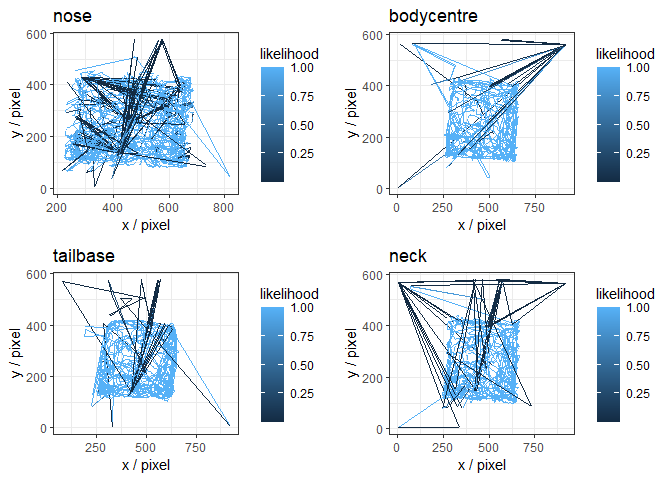<!-- -->

as you can see the tracking was not perfect, and all points had some tracking problems every now and then. If we want to remove and interpolate the outliers based on low likelihood from DLC we can do this by


```r
Tracking <- CleanTrackingData(Tracking, likelihoodcutoff = 0.95)
```

```
## [1] "interpolating points with likelihood < 0.95"
```

```r
PlotPointData(Tracking, points = c("nose","bodycentre","tailbase","neck"))
```

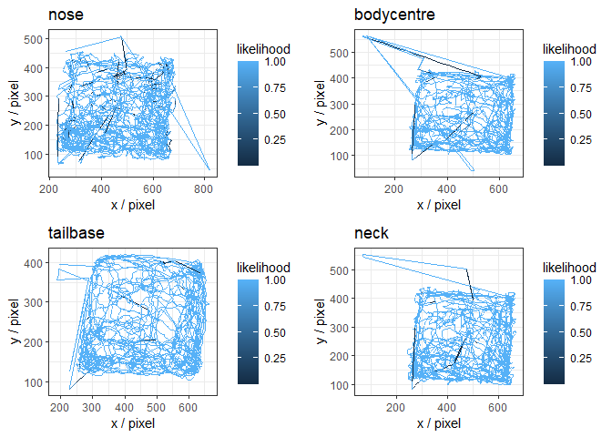<!-- -->

This looks already better, but there are still some points that were tracked incorrectly with high likelihood. When inspecting these OFT videos it becomes apparent that the video runs on after the trial is over which leads to mislabeling when the light in the camber turns on and the mouse is picked up. Lets get rid of the last 250 frames (=10 seconds) and see if this solves the issue


```r
Tracking <- CutTrackingData(Tracking, end = 250)
PlotPointData(Tracking, points = c("nose","bodycentre","tailbase","neck"))
```

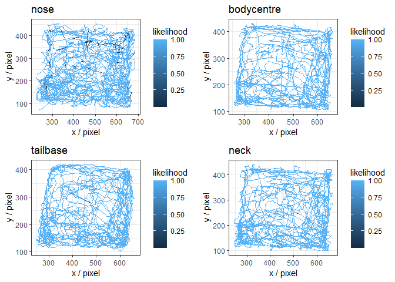<!-- -->

as you can see this removed the artefacts in the data sufficiently

Next, we want to calibrate our Tracking data to transform it from a pixel dimension into a metric dimension. In this case we measured the physical distance of the area in cms (42 x 42) which is span by the points tl, tr, br and bl


```r
Tracking <- CalibrateTrackingData(Tracking, method = "area",in.metric = 42*42, points = c("tl","tr","br","bl"))
Tracking$px.to.cm
```

```
## [1] 0.1242373
```

```r
PlotPointData(Tracking, points = c("nose","bodycentre","tailbase","neck"))
```

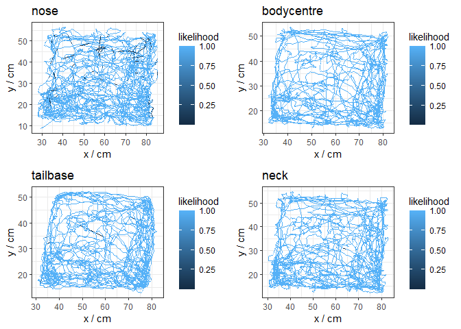<!-- -->

As you can see now the px.to.cm ratio was calculated and the data was automatically transformed into a metric dimension. The same process is possible with a pre defined ratio or with a distance measurement between two points

## OFT analysis on a single file

Here we will explore how we can perform an OFT (open field test) analysis on a single file

lets start by loading and pre-processing the data:


```r
Tracking <- ReadDLCDataFromCSV(file = "example/OFT/DLC_Data/OFT_3.csv", fps = 25)
Tracking <- CleanTrackingData(Tracking, likelihoodcutoff = 0.95)
Tracking <- CutTrackingData(Tracking,start = 100, end = 250)
Tracking <- CalibrateTrackingData(Tracking, method = "area",in.metric = 42*42, points = c("tl","tr","br","bl"))
```

In a OFT analysis we want quantify how much / fast an animal moves, how much time it spends in different zones and other metrics
Lets start with creating the zones. DLCAnalyzer has a built in function to create a set of OFT zones based on tracking data from the 4 corners of the arena. 
To create OFT zones use:


```r
Tracking <- AddOFTZones(Tracking, scale_center = 0.5,scale_periphery  = 0.8 ,scale_corners = 0.4, points = c("tl","tr","br","bl"))
PlotZones(Tracking)
```

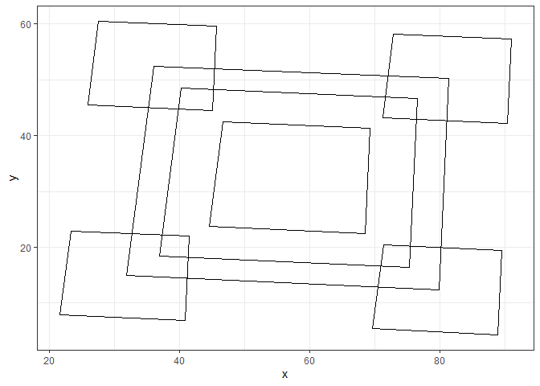<!-- -->

As you can see the function created the OFT Zones and stored them as part of the Tracking object.
Now we can resolve whenever a body point is in a certain zone 


```r
PlotZoneVisits(Tracking,point = c("bodycentre","nose","tailbase"))
```

<!-- -->

However, we might be interested in adding new zones independent of any method. If we would want to add 2 new triangular zones and only get a readout for them we could do:


```r
Tracking <- AddZones(Tracking,z = data.frame(my.zone.1 = c("tl","tr","centre"),
                                             my.zone.2 = c("bl","br","centre")))
PlotZones(Tracking, zones=c("my.zone.1","my.zone.2", "arena"))
```

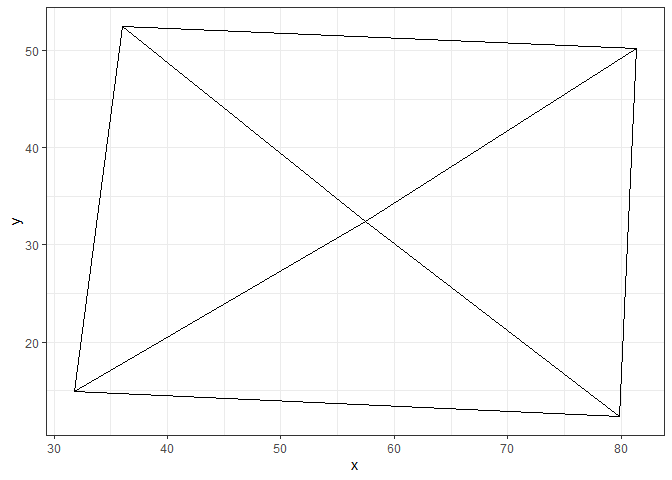<!-- -->

```r
PlotZoneVisits(Tracking,point = c("bodycentre","nose","tailbase"),zones = c("my.zone.1","my.zone.2"))
```

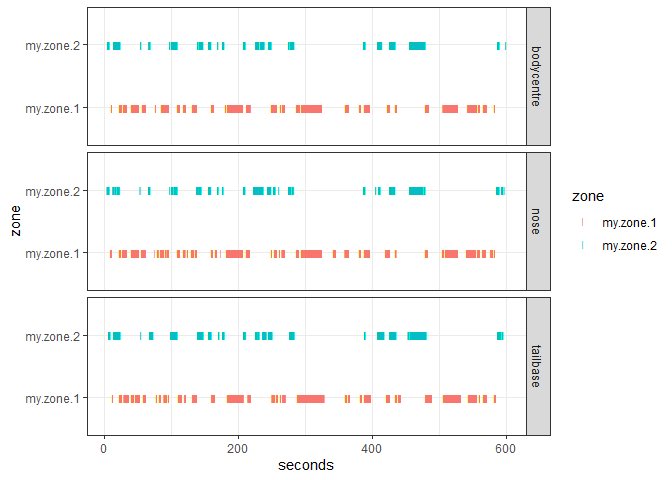<!-- -->

In order to get metrics such as speed or movement we use


```r
Tracking <- CalculateMovement(Tracking, movement_cutoff = 5, integration_period = 5)
head(Tracking$data$bodycentre)
```

```
##     frame        x        y likelihood     delta_x   delta_y     speed
## 101   100 80.81787 32.89231  1.0000000  0.00000000 0.0000000 0.0000000
## 102   101 80.70215 33.73722  1.0000000 -0.11572608 0.8449100 0.8527986
## 103   102 80.64904 34.71746  0.9999999 -0.05310299 0.9802457 0.9816831
## 104   103 80.68205 35.67790  1.0000000  0.03300215 0.9604341 0.9610009
## 105   104 80.77437 36.69072  1.0000000  0.09231983 1.0128258 1.0170246
## 106   105 80.90046 37.53886  1.0000000  0.12609781 0.8481378 0.8574604
##     acceleration is.moving
## 101   0.00000000      TRUE
## 102   0.85279862      TRUE
## 103   0.12888444      TRUE
## 104  -0.02068217      TRUE
## 105   0.05602369      TRUE
## 106  -0.15956418      TRUE
```

the movement cutoff defines at which cutoff (units / s, here cm) we are considering something moving. the integration_period is important for transitions. It will define over how many frames (+- period) transitions between zones are analysed and for how long an animal has to be moving to be considered so. This can help to remove noisy interpretations, i.e. where a point jumps over the zone line multiple times in short succession.

Now that we have calculated all metrics which are important for our analysis we can create a density plot that encapsulates speed, time spent and position for points


```r
plots <- PlotDensityPaths(Tracking,points = c("bodycentre","nose","tailbase"))
plots$bodycentre
```

<!-- -->

```r
plots$nose
```

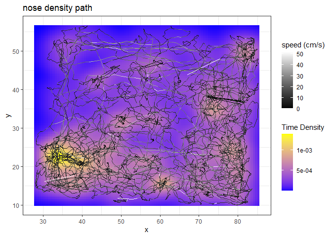<!-- -->

We can add our zones to the plot


```r
plots <- AddZonesToPlots(plots,Tracking$zones)
plots$bodycentre
```

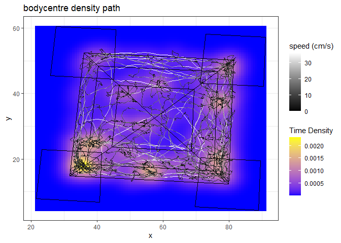<!-- -->

We are interested what happens in the center over the whole recording. For this we can generate a zone report


```r
Report <- ZoneReport(Tracking, point = "bodycentre", zones = "center")
t(data.frame(Report))
```

```
##                                [,1]
## center.raw.distance      576.631995
## center.distance.moving   465.740093
## center.raw.speed           7.225965
## center.speed.moving       13.554717
## center.time.moving        34.360000
## center.total.time         79.800000
## center.time.stationary    45.440000
## center.percentage.moving  43.057644
## center.transitions        58.000000
```

we can also generate a report based on a combination of zones. the following example we create a report for whenever the bodycentre is neither in my.zone.1 or in my.zone.2 (we look at the inversion of a combined zone)


```r
Report <- ZoneReport(Tracking, point = "bodycentre", zones = c("my.zone.1","my.zone.2"), zone.name = "OutsideMyZones", invert = TRUE)
t(data.frame(Report))
```

```
##                                         [,1]
## OutsideMyZones.raw.distance      2163.874512
## OutsideMyZones.distance.moving   1605.955531
## OutsideMyZones.raw.speed            6.289602
## OutsideMyZones.speed.moving        11.396221
## OutsideMyZones.time.moving        140.920000
## OutsideMyZones.total.time         344.040000
## OutsideMyZones.time.stationary    203.120000
## OutsideMyZones.percentage.moving   40.960353
## OutsideMyZones.transitions        126.000000
```

Now we get a report for what happens when the animal is not in my.zone.1 or my.zone.2. if we want to check if our zone was set correctly we can quickly do this with:


```r
PlotZoneSelection(Tracking, point = "bodycentre", zones = c("my.zone.1","my.zone.2"), invert = TRUE)
```

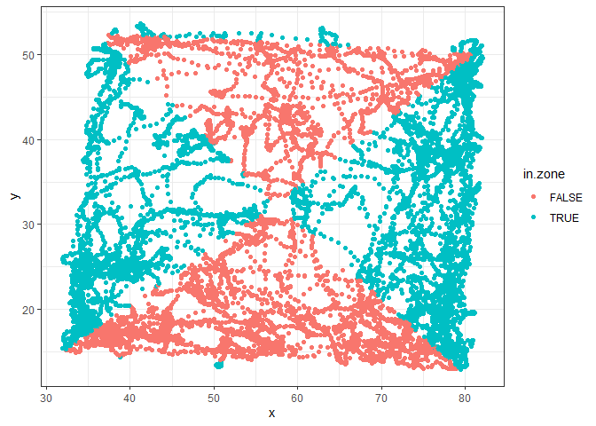<!-- -->

For an easy preset OFT analysis of one or multiple points you can also use the command:


```r
Tracking <- OFTAnalysis(Tracking, points = "bodycentre" ,movement_cutoff = 5, integration_period = 5)
t(data.frame(Tracking$Report))
```

```
##                                               [,1]
## bodycentre.raw.distance                4008.339382
## bodycentre.distance.moving             3078.993566
## bodycentre.raw.speed                      6.724499
## bodycentre.speed.moving                  12.202733
## bodycentre.time.moving                  252.320000
## bodycentre.total.time                   596.080000
## bodycentre.time.stationary              343.760000
## bodycentre.percentage.moving             42.329889
## bodycentre.center.raw.distance          576.631995
## bodycentre.center.distance.moving       465.740093
## bodycentre.center.raw.speed               7.225965
## bodycentre.center.speed.moving           13.554717
## bodycentre.center.time.moving            34.360000
## bodycentre.center.total.time             79.800000
## bodycentre.center.time.stationary        45.440000
## bodycentre.center.percentage.moving      43.057644
## bodycentre.center.transitions            58.000000
## bodycentre.periphery.raw.distance      2074.391842
## bodycentre.periphery.distance.moving   1539.293272
## bodycentre.periphery.raw.speed            6.387461
## bodycentre.periphery.speed.moving        11.196489
## bodycentre.periphery.time.moving        137.480000
## bodycentre.periphery.total.time         324.760000
## bodycentre.periphery.time.stationary    187.280000
## bodycentre.periphery.percentage.moving   42.332800
## bodycentre.periphery.transitions        114.000000
## bodycentre.corners.raw.distance         986.594792
## bodycentre.corners.distance.moving      678.994897
## bodycentre.corners.raw.speed              5.766862
## bodycentre.corners.speed.moving           9.666784
## bodycentre.corners.time.moving           70.240000
## bodycentre.corners.total.time           171.080000
## bodycentre.corners.time.stationary      100.840000
## bodycentre.corners.percentage.moving     41.056816
## bodycentre.corners.transitions          105.000000
```

## OFT analysis for multiple files

in order to run multiple files the best practice is to first define a pipeline of commands, and then execute it for all files in a folder.
First we define the path to our folder of interest and find the files.


```r
input_folder <- "example/OFT/DLC_Data/"
files <- list.files(input_folder) 
files
```

```
## [1] "OFT_1.csv" "OFT_2.csv" "OFT_3.csv" "OFT_4.csv"
```

Now, we define our processing pipeline. In order to check if it is runing appropriatley it is advisable to first run it for a single file interactively


```r
pipeline <- function(path){
  Tracking <- ReadDLCDataFromCSV(path, fps = 25)
  Tracking <- CutTrackingData(Tracking,start = 100, end = 300)
  Tracking <- CalibrateTrackingData(Tracking, "area",in.metric = 42*42, points = c("tr","tl","bl","br"))
  Tracking <- CleanTrackingData(Tracking, likelihoodcutoff = 0.95)
  Tracking <- AddOFTZones(Tracking, scale_center = 0.5,scale_periphery  = 0.8 ,scale_corners = 0.4)
  Tracking <- OFTAnalysis(Tracking, movement_cutoff = 5, integration_period = 5, points = "bodycentre")
  return(Tracking)
}
```

Now that the pipeline is defined we can execute it for all files and combine them into a list of Tracking objects


```r
TrackingAll <- RunPipeline(files,input_folder,FUN = pipeline)
```

From the list we can access individual results with the $ operator. for example if we want to plot the zone visits for the first file we can simply use:


```r
Tracking <- TrackingAll$`OFT_1.csv`
PlotZoneVisits(Tracking, point = "bodycentre")
```

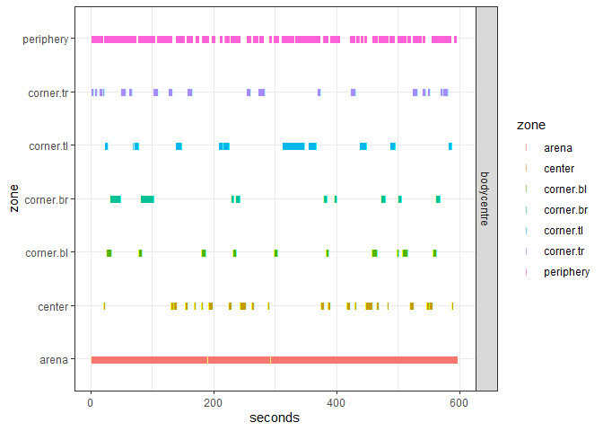<!-- -->

To get a combined report of all files we can use the following command. (here we only display the first 6 columns)


```r
Report <- MultiFileReport(TrackingAll)
Report[,1:6]
```

```
##        file bodycentre.raw.distance bodycentre.distance.moving
## 1 OFT_1.csv                3673.864                   2633.114
## 2 OFT_2.csv                3908.624                   2965.331
## 3 OFT_3.csv                3992.621                   3065.385
## 4 OFT_4.csv                3817.537                   2799.329
##   bodycentre.raw.speed bodycentre.speed.moving bodycentre.time.moving
## 1             6.192879                11.80981                 222.96
## 2             6.591272                11.02354                 269.00
## 3             6.720679                12.21464                 250.96
## 4             6.435064                12.41277                 225.52
```

Additionally, we can create PDF files with multiplots for all analyses. They will appear in the working directory.


```r
PlotDensityPaths.Multi.PDF(TrackingAll,points = c("bodycentre"), add_zones = TRUE)
PlotZoneVisits.Multi.PDF(TrackingAll,points = c("bodycentre","nose","tailbase"))
```

## EPM analysis for a single file

Here we will describe how a EPM (elevated plus maze) analysis for a single file can be performed using DLCAnalyser
similar as in previous sections, we start by loading and cleaning up our data


```r
Tracking <- ReadDLCDataFromCSV(file = "example/EPM/DLC_Data/EPM_1.csv", fps = 25)
names(Tracking$data)
```

```
##  [1] "tl"         "tr"         "bl"         "br"         "lt"        
##  [6] "lb"         "rt"         "rb"         "ctl"        "ctr"       
## [11] "cbl"        "cbr"        "nose"       "headcentre" "neck"      
## [16] "earl"       "earr"       "bodycentre" "bcl"        "bcr"       
## [21] "hipl"       "hipr"       "tailbase"   "tailcentre" "tailtip"
```

As you we see, the EPM network contains additional/different points than the OFT network. Many of these additional points are used to track the maze which allows automatic reconstruction of the zones for each file.


```r
Tracking <- CutTrackingData(Tracking,start = 100, end = 250)
Tracking <- CalibrateTrackingData(Tracking, method = "distance",in.metric = 65.5, points = c("tl","br"))
Tracking <- CleanTrackingData(Tracking, likelihoodcutoff = 0.95)
```

```
## [1] "interpolating points with likelihood < 0.95"
```

```r
PlotPointData(Tracking,points = c("nose","bodycentre","tailbase","neck"))
```

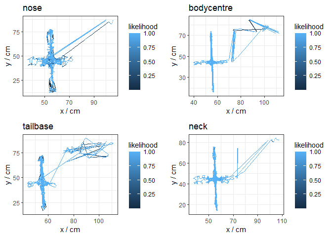<!-- -->

As we can see, the data looks messy even after the likelihood cutoff. We will get back to that with a further trick. However, for the EPM analysis we also need a number of zones that describe the maze (open arms, closed arms etc.). Rather than constructing them in all independently there is the option to use a template file that describes the zones and add them to the object automatically.
First, we load the template .csv file


```r
zoneinfo <- read.table("example/EPM/EPM_zoneinfo.csv", sep = ";", header = T)
zoneinfo
```

```
##    arena closed.top closed.bottom open.left open.right center
## 1     tl         tl           cbr        lt         rt    ctr
## 2     tr         tr            br       ctl         rb    ctl
## 3    ctr        ctr            bl       cbl        cbr    cbl
## 4     rt        ctl           cbl        lb        ctr    cbr
## 5     rb                                                     
## 6    cbr                                                     
## 7     br                                                     
## 8     bl                                                     
## 9    cbl                                                     
## 10    lb                                                     
## 11    lt                                                     
## 12   ctl
```

As we can see this file simply contains a number of columns that each contain a list or point names from our DLCnetwork. Each column of points describes a zone which they span. We can add this info to the Tracking data


```r
Tracking <- AddZones(Tracking,zoneinfo)
PlotZones(Tracking)
```

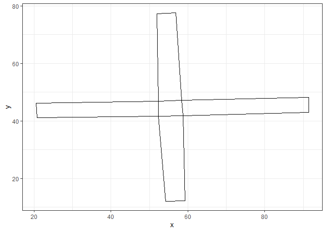<!-- -->

Our zone file also contains one zone that describes the whole area


```r
Tracking$zones$arena
```

```
##            x        y
## tl  54.20463 12.14935
## tr  59.25509 12.24627
## ctr 58.71096 41.75957
## rt  91.44434 42.93796
## rb  91.39501 48.18231
## cbr 58.34143 47.25563
## br  56.91344 77.59331
## bl  51.88961 77.35742
## cbl 52.28233 46.93509
## lb  20.54313 46.22350
## lt  20.80582 41.08305
## ctl 52.33481 41.69020
```

We can use this to further clean up our data. we scale it by a factor 1.8 to define an inclusion zone


```r
inclusion.zone <- ScalePolygon(Tracking$zones$arena, 1.8)
```

Now we can use this zone to further clean up our data. every point that falls outside of it will be removed and interpolated


```r
Tracking <- CleanTrackingData(Tracking, likelihoodcutoff = 0.95,existence.pol = inclusion.zone)
```

```
## [1] "interpolating points with likelihood < 0.95"
## [1] "interpolating points which are outside of the existence area"
```

```r
PlotPointData(Tracking,points = c("nose","bodycentre","tailbase","neck"))
```

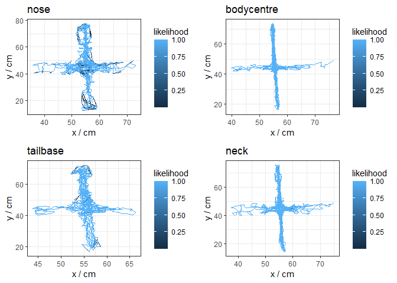<!-- -->

We can now perform an EPM analysis. This will record time in zones and many other metrics. if nosedips is enabled it will automatically detect nose dips. This will only works if the correctly named points and zones are present in the DLCnetwork and zoneinfo file, otherwise it will omit the nosedip analysis and report a warning.


```r
Tracking <- EPMAnalysis(Tracking, movement_cutoff = 5,integration_period = 5,points = "bodycentre", nosedips = TRUE)
t(data.frame(Tracking$Report[1:6]))
```

```
##                                   [,1]
## nose.dip                     33.000000
## bodycentre.raw.distance    1768.007995
## bodycentre.distance.moving  898.767567
## bodycentre.raw.speed          2.880055
## bodycentre.speed.moving       9.182341
## bodycentre.time.moving       97.880000
```

We can create a time resolved plot of all nose dips. for this we use:


```r
PlotLabels(Tracking)
```

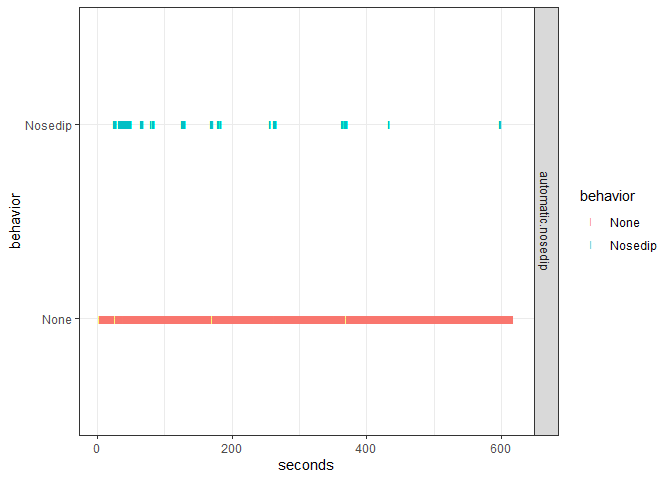<!-- -->

## EPM analysis for mutliple files

Here we will cover an EPM (elevated plus maze) analysis for multiple files.
Similar to multiple OFT files, we first define a pipeline and then execute it for all EPM files


```r
input_folder <- "example/EPM/DLC_Data/"
files <- list.files(input_folder) 
files
```

```
## [1] "EPM_1.csv" "EPM_2.csv" "EPM_3.csv" "EPM_4.csv"
```


```r
pipeline <- function(path){
  Tracking <- ReadDLCDataFromCSV(file = path, fps = 25)
  Tracking <- CutTrackingData(Tracking,start = 100, end = 250)
  Tracking <- CalibrateTrackingData(Tracking, method = "distance",in.metric = 65.5, points = c("tl","br"))
  zoneinfo <- read.table("example/EPM/EPM_zoneinfo.csv", sep = ";", header = T)
  Tracking <- AddZones(Tracking,zoneinfo)
  Tracking <- CleanTrackingData(Tracking, likelihoodcutoff = 0.95,existence.pol = ScalePolygon(Tracking$zones$arena, 1.8))
  Tracking <- EPMAnalysis(Tracking, movement_cutoff = 5,integration_period = 5,points = "bodycentre", nosedips = TRUE)
  return(Tracking)
}

TrackingAll <- RunPipeline(files,input_folder,FUN = pipeline)
```

Again, we can create a report for all files using the following command (here we only show the first 6 columns)


```r
Report <- MultiFileReport(TrackingAll)
Report[,1:6]
```

```
##        file nose.dip bodycentre.raw.distance bodycentre.distance.moving
## 1 EPM_1.csv       33               1768.0080                  898.76757
## 2 EPM_2.csv       17               2027.8865                  941.75085
## 3 EPM_3.csv        1                578.6794                   56.44209
## 4 EPM_4.csv       58               2886.3323                 1591.10968
##   bodycentre.raw.speed bodycentre.speed.moving
## 1             2.880055                9.182341
## 2             3.442931               10.935333
## 3             0.944012                6.849769
## 4             4.773322               10.949007
```

We can see that animal 3 has very few nosedips, whereas animal 4 seems to have a lot. We can quickly compare both with the following commands to create overviewplots for them.


```r
OverviewPlot(TrackingAll$EPM_4.csv,"bodycentre")
OverviewPlot(TrackingAll$EPM_3.csv,"bodycentre")
```


Indeed, it becomes apparent that animal 3 was hiding in the bottom closed arm for most of the test, whereas animal 4 showed a rich explorative behavior

Additionally, we can create PDF files with multiplots for all analyses. They will appear in your working directory.


```r
PlotDensityPaths.Multi.PDF(TrackingAll,points = c("bodycentre"), add_zones = TRUE)
PlotZoneVisits.Multi.PDF(TrackingAll,points = c("bodycentre","nose","tailbase"))
PlotLabels.Multi.PDF(TrackingAll)
```

## FST analysis for one file

Here we will describe how a FST (forced swim test) analysis for a single file can be performed
Similar to previous sections, we start by loading and cleaning up our data


```r
Tracking <- ReadDLCDataFromCSV(file = "example/FST/DLC_Data/FST_1.csv", fps = 25)
Tracking <- CutTrackingData(Tracking,start = 300, end = 100)
Tracking <- CalibrateTrackingData(Tracking, "distance",in.metric = 20, points = c("t","b"))
Tracking <- CleanTrackingData(Tracking, likelihoodcutoff = 0.95)
```

And we inspect our data to controll the integrity


```r
PlotPointData(Tracking,points = c("nose","bodycentre","tailbase","neck"))
```

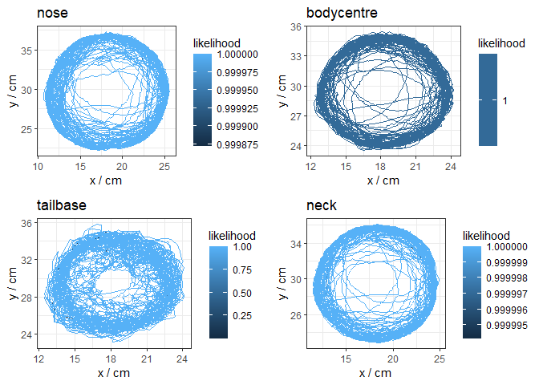<!-- -->

As we can see the data looks good already. we can now proceed to run the analysis. But first, for an FST analysis we need to specify further information. For this type of analysis we have to measure the movement of all points that are part of the mouse and analyse them in order to detect floating behavior.
If we inspect the pointinfo of our object


```r
Tracking$point.info
```

```
##     PointName  PointType
## 1           t NotDefined
## 2           b NotDefined
## 3           l NotDefined
## 4           r NotDefined
## 5        nose NotDefined
## 6  headcentre NotDefined
## 7        neck NotDefined
## 8        earl NotDefined
## 9        earr NotDefined
## 10 bodycentre NotDefined
## 11        bcl NotDefined
## 12        bcr NotDefined
## 13       hipl NotDefined
## 14       hipr NotDefined
## 15   tailbase NotDefined
## 16 tailcentre NotDefined
## 17    tailtip NotDefined
```

We can see that there is not yet any info that describes which point belongs to the mouse. Here we will load this info from a .csv file and add it to the object: (however, this could also be done manually by directly changing Tracking$point.info)


```r
pointinfo <- read.table("example/FST/FST_pointinfo.csv", sep = ";", header = T)
Tracking <- AddPointInfo(Tracking, pointinfo)
Tracking$point.info
```

```
##     PointName PointType
## 1           t      Maze
## 2           b      Maze
## 3           l      Maze
## 4           r      Maze
## 5        nose     Mouse
## 6  headcentre     Mouse
## 7        neck     Mouse
## 8        earl     Mouse
## 9        earr     Mouse
## 10 bodycentre     Mouse
## 11        bcl     Mouse
## 12        bcr     Mouse
## 13       hipl     Mouse
## 14       hipr     Mouse
## 15   tailbase     Mouse
## 16 tailcentre     Mouse
## 17    tailtip     Mouse
```

Now that he Tracking info has the additional information about point type we can run an FST analysis. we specify a cutoff_floating of 0.03, for which we found it to track floating behavior optimally. We also specify that the object we want to track is of type "Mouse"


```r
Tracking <- FSTAnalysis(Tracking,cutoff_floating = 0.03,integration_period = 10, Object = "Mouse", points = "bodycentre")
Tracking$Report
```

```
## $time.floating
## [1] 48.92
## 
## $total.time
## [1] 359.04
## 
## $percentage.floating
## [1] 13.62522
## 
## $bodycentre.raw.distance
## [1] 2419.805
## 
## $bodycentre.raw.speed
## [1] 6.739653
## 
## $bodycentre.distance.swiming
## [1] 2329.589
## 
## $bodycentre.speed.swiming
## [1] 7.511897
```

```r
PlotLabels(Tracking)
```

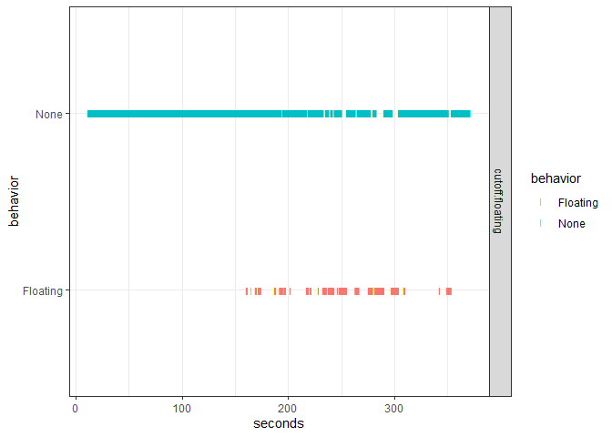<!-- -->

As we can see, in this case the floating behavior of the mouse increased in the later part of the swim test.

## FST analysis for multiple files

Here we will describe how multiple FST (forced swim test) files can be analyzed together.
Similar to multiple OFT files, we first set the path, define a pipeline and then execute it for all FST files


```r
input_folder <- "example/FST/DLC_Data/"
files <- list.files(input_folder) 
files[1:5]
```

```
## [1] "FST_1.csv"  "FST_11.csv" "FST_16.csv" "FST_2.csv"  "FST_3.csv"
```

We define the processing pipeline


```r
pipeline <- function(path){
  Tracking <- ReadDLCDataFromCSV(file = path, fps = 25)
  Tracking <- CutTrackingData(Tracking,start = 300, end = 100)
  Tracking <- CalibrateTrackingData(Tracking, "distance",in.metric = 20, points = c("t","b"))
  Tracking <- CleanTrackingData(Tracking, likelihoodcutoff = 0.95)
  pointinfo <- read.table("example/FST/FST_pointinfo.csv", sep = ";", header = T)
  Tracking <- AddPointInfo(Tracking, pointinfo)
  Tracking <- FSTAnalysis(Tracking,cutoff_floating = 0.03,integration_period = 10, Object = "Mouse", points = "bodycentre")
  return(Tracking)
}
```

We execute the pipeline for all files and combine them into a list of Tracking objects. We can then get a final report:


```r
TrackingAll <- RunPipeline(files,input_folder,FUN = pipeline)
Report <- MultiFileReport(TrackingAll)
```


```r
Report[1:5,1:5]
```

```
##         file time.floating total.time percentage.floating
## 1  FST_1.csv         48.92     359.04            13.62522
## 2 FST_11.csv         63.36     359.56            17.62154
## 3 FST_16.csv        107.40     361.20            29.73422
## 4  FST_2.csv        127.92     372.16            34.37231
## 5  FST_3.csv         99.48     356.84            27.87804
##   bodycentre.raw.distance
## 1                2419.805
## 2                1794.816
## 3                1732.207
## 4                1674.447
## 5                1533.503
```

Additionally, we can create a PDF with all the label plots using the following command. by default it will be placed in your working directory


```r
PlotLabels.Multi.PDF(TrackingAll)
```

## Runing a bin analysis

Often, in behavioral research readouts are required in time bins. DLC analyser has a fully integrated approach that allows analyses within bins. Here, we will be doing a bin analysis for floating behavior to see if it increases in animals at later time-points.


```r
Tracking <- ReadDLCDataFromCSV(file = "example/FST/DLC_Data/FST_1.csv", fps = 25)
Tracking <- CutTrackingData(Tracking,start = 300, end = 100)
Tracking <- CalibrateTrackingData(Tracking, "distance",in.metric = 20, points = c("t","b"))
Tracking <- CleanTrackingData(Tracking, likelihoodcutoff = 0.95)
pointinfo <- read.table("example/FST/FST_pointinfo.csv", sep = ";", header = T)
Tracking <- AddPointInfo(Tracking, pointinfo)
```

We did not yet run any analysis, since first we need to add the informatino about the bins. Here we add 1 minute bins.


```r
Tracking <- AddBinData(Tracking,unit = "minute", binlength = 1)
Tracking$bins
```

```
##     bin from   to
## 1 bin.1  300 1799
## 2 bin.2 1800 3299
## 3 bin.3 3300 4799
## 4 bin.4 4800 6299
## 5 bin.5 6300 7799
## 6 bin.6 7800 9275
```

Optional, you can also load bins from a data.frame. this is especially interesting if you have unequal sized bins. In this example we have a first and last bin of 1.5 minutes and a longer intermediate bin of 3 minutes


```r
my.bins <- read.table("example/FST/FST_BinData.csv", sep = ";", header = T)
my.bins
```

```
##   bin from  to
## 1  B1  0.0 1.5
## 2  B2  1.5 4.5
## 3  B3  4.5 6.0
```

```r
Tracking <- AddBinData(Tracking,bindat = my.bins, unit = "minute")
Tracking$bins
```

```
##   bin from   to
## 1  B1    0 2250
## 2  B2 2250 6750
## 3  B3 6750 9000
```

Now, we can perform a bin analysis using:


```r
BinReport <- BinAnalysis(Tracking, FUN = FSTAnalysis ,cutoff_floating = 0.03,integration_period = 10, Object = "Mouse", points = "bodycentre")
BinReport[,1:5]
```

```
##   bin time.floating total.time percentage.floating bodycentre.raw.distance
## 1  B1          0.00      78.04             0.00000               1048.8812
## 2  B2         26.12     180.04            14.50789                934.1423
## 3  B3         22.80      90.04            25.32208                378.6860
```

It is important to note that the function BinAnalysis() takes an other function as argument (FSTAnalysis). Therefore it is crucial to pass all the arguments the function FSTAnalysis() requires along whenever using BinAnalysis(), In this case these were: cutoff_floating, integration_period, Object and points. The same applies to other functions such as OFTAnalysis() or EPMAnalysis() for the respective tests, which are also compatible with the Mutltibinanalysis

We can do the same for multiple files (here again in our custom bins):


```r
input_folder <- "example/FST/DLC_Data/"
files <- list.files(input_folder) 

pipeline <- function(path){
  Tracking <- ReadDLCDataFromCSV(file = path, fps = 25)
  Tracking <- CutTrackingData(Tracking,start = 300, end = 100)
  Tracking <- CalibrateTrackingData(Tracking, "distance",in.metric = 20, points = c("t","b"))
  Tracking <- CleanTrackingData(Tracking, likelihoodcutoff = 0.95)
  pointinfo <- read.table("example/FST/FST_pointinfo.csv", sep = ";", header = T)
  Tracking <- AddPointInfo(Tracking, pointinfo)
  my.bins <- read.table("example/FST/FST_BinData.csv", sep = ";", header = T)
  Tracking <- AddBinData(Tracking,bindat = my.bins, unit = "minute")
  return(Tracking)
}

TrackingAll <- RunPipeline(files,input_folder,FUN = pipeline)
BinReportAll <- MultiFileBinanalysis(TrackingAll, FUN = FSTAnalysis ,cutoff_floating = 0.03,integration_period = 10, Object = "Mouse", points = "bodycentre")
```

And we can see that the bins for each file are now included in one data frame


```r
BinReportAll[1:6,1:5]
```

```
##         file bin time.floating total.time percentage.floating
## 1  FST_1.csv  B1          0.00      78.04             0.00000
## 2  FST_1.csv  B2         26.12     180.04            14.50789
## 3  FST_1.csv  B3         22.80      90.04            25.32208
## 4 FST_11.csv  B1          0.00      78.04             0.00000
## 5 FST_11.csv  B2         27.36     180.04            15.19662
## 6 FST_11.csv  B3         34.04      90.04            37.80542
```

We can now answer our question if floating increases in the later parts of the tests:


```r
ggplot(data = BinReportAll, aes(bin,percentage.floating, color = bin)) + geom_boxplot() + geom_point(position = position_jitterdodge())
```

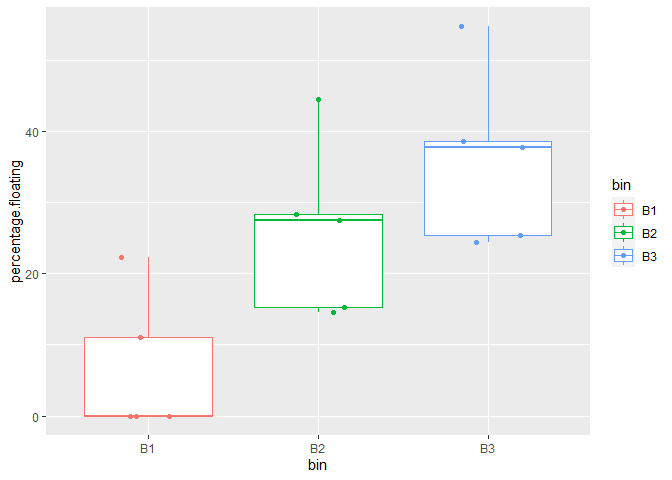<!-- -->

As you can see here, the time floating seems to increase in the later bins compared to the earlier bin

## Training a machine learning classifier on a single file

This section requires a working install of the keras library which itself requires a working anaconda and tensorflow install!
Here we will explore how a neural network can be trained to recognize complex behaviors. We will work with the forced swim test data (FST).

first, we will see how we can generate features from one single file and add the labeling data from a human experimenter to it. We start with our standard pipeline to load, clean and calibrate the data


```r
file <- "FST_3.csv"
path <- "example/FST/DLC_Data/"
Tracking <- ReadDLCDataFromCSV(paste(path,file,sep = ""), fps = 25)
Tracking <- CutTrackingData(Tracking,start = 300,end = 300)
Tracking <- CalibrateTrackingData(Tracking, "distance",in.metric = 20, c("t","b"))
Tracking <- CleanTrackingData(Tracking, likelihoodcutoff = 0.95)
```

```
## [1] "interpolating points with likelihood < 0.95"
```

```r
PlotPointData(Tracking,points = c("nose","bodycentre","tailbase","neck"))
```

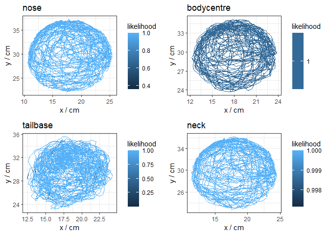<!-- -->

As we can see, the data looks good. Now, lets add the labeling data. For this, we first load it from a file which containes labeling data of only one experimenter


```r
labeling.data <- read.table("example/FST/Lables/FSTLables_Oliver.csv",sep = ";", header = T)
head(labeling.data)
```

```
##            file Experimenter    from      to     type    ID   CSVname
## 1 FST_1_OS.json       Oliver 161.315 162.023 Floating FST_1 FST_1.csv
## 2 FST_1_OS.json       Oliver 180.148 181.190 Floating FST_1 FST_1.csv
## 3 FST_1_OS.json       Oliver 194.252 195.711 Floating FST_1 FST_1.csv
## 4 FST_1_OS.json       Oliver 238.544 243.711 Floating FST_1 FST_1.csv
## 5 FST_1_OS.json       Oliver 247.544 256.086 Floating FST_1 FST_1.csv
## 6 FST_1_OS.json       Oliver 264.211 267.252 Floating FST_1 FST_1.csv
```

As you can see the data is prepared in a specific way that links onset and offset of behaviors to a specific file. To get the data from this one file and add it to our object we use:


```r
labeling.data <- labeling.data[labeling.data$CSVname == Tracking$file,]
Tracking <- AddLabelingData(Tracking, labeling.data)
PlotLabels(Tracking)
```

<!-- -->

Now that we have our labeling data, we have to think about how to create our feature data from our Tracking data. here we will use the information about point acceleration to train a floating classifier. For this, we first have to calculate accelerations for each of our point


```r
Tracking <- CalculateAccelerations(Tracking)
```

now we use a preset function that extracts our features from the point data and stitches them into a single feature data frame


```r
Tracking <- CreateAccelerationFeatures(Tracking)
dim(Tracking$features)
```

```
## [1] 8721   11
```

```r
head(Tracking$features)
```

```
##          Ac1        Ac2        Ac3         Ac4        Ac5       Ac6
## 1 0.00000000 0.00000000 0.00000000 0.000000000 0.00000000 0.0000000
## 2 0.70364005 0.84263299 0.79463419 1.078669248 0.59288519 0.6075375
## 3 0.03091827 0.35336644 0.32028023 0.690942118 0.06632972 0.1340865
## 4 0.27789120 0.01074698 0.03835287 0.008566107 0.23316516 0.3656796
## 5 0.22521630 0.02661151 0.18591229 0.292888597 0.06133694 0.1111796
## 6 0.01179494 0.23833878 0.18212494 0.046773330 0.08006044 0.1597061
##          Ac7       Ac8       Ac9       Ac10       Ac11
## 1 0.00000000 0.0000000 0.0000000 0.00000000 0.00000000
## 2 0.37826638 1.0438418 0.5828617 0.91509022 0.70059014
## 3 0.40214529 0.3127807 0.2505706 0.09363059 0.19325479
## 4 0.47959941 0.3190547 0.6935170 0.28717776 0.08105392
## 5 0.07065679 0.1281449 0.0278687 0.12983416 0.17598115
## 6 0.00222199 0.1486256 0.3335403 0.29719210 0.27950086
```

As you can see, our feature data now contains acceleration of 11 points, in this case all points except the tail points. It is important to note here, that the function CreateAccelerationFeatures() is very specific for a certain DLC network, so any network that produces different points, or points with different names will not work properly!
Additionally, we also want to incorporate temporal information. For this we use the following command. In the process data from previous and following frames will be added to our features at each frame, depending on a specified integration period, here +- 20 frames.


```r
Tracking <- CreateTrainingSet(Tracking, integration_period = 20)
dim(Tracking$train_x)
```

```
## [1] 8681  451
```

```r
head(Tracking$train_y)
```

```
## [1] "None" "None" "None" "None" "None" "None"
```

As we can see, now the train_x data is much bigger, having 451 features (=41 x 11) that represent acceleration of 11 points over a window of +- 20 frames. We can now use the following command to prepare the data so it can directly be used with keras. We set shuffle to TRUE so the data gets randomly shuffled before training a network with it


```r
MLData <- CombineTrainingsData(Tracking, shuffle = TRUE)
```

Now, we define the architecture of the network that we want to train. We will not go into the details of the model used here, it is advisable to read the documentation on tensorflow.org for specific details.


```r
model <- keras_model_sequential() 
model %>% 
  layer_dense(units = 256, activation = 'relu', input_shape = c(MLData$parameters$N_input),kernel_regularizer = regularizer_l2(l = 0)) %>% 
  layer_dropout(rate = 0.4) %>% 
  layer_dense(units = 128, activation = 'relu',kernel_regularizer = regularizer_l2(l = 0)) %>%
  layer_dropout(rate = 0.3) %>%
  layer_dense(units = MLData$parameters$N_features, activation = 'softmax')

model %>% compile(
  loss = 'categorical_crossentropy',
  optimizer = optimizer_rmsprop(),
  metrics = c('accuracy')
)
```

We train the model with our data using the following command


```r
history <- model %>% fit(
  MLData$train_x, MLData$train_y, 
  epochs = 5, batch_size = 32, 
  validation_split = 0
)
```

We can evaluate the model with the same data using the following function:


```r
Tracking <- ClassifyBehaviors(Tracking,model,MLData$parameters)
```

```r
PlotLabels(Tracking)
```

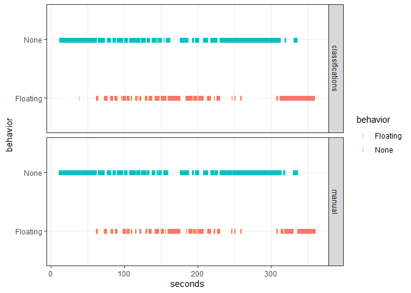<!-- -->

As we can see, the classifier performes closely to the original manual tracking. However, here we have to be very carefull here. We just trained with the same data that we tested on, and we used data from one single video. The results here are not very solid. In the next section we will see how we can use a one vs all approach to create a new training data set using multiple labeled recordings and test them with a cross validation file

## Training a robust classifier and cross validating it

In order to train a more robust classifiers we need more trainings data. Here we again use the FST dataset, for which we have 5 annotated videos in this example. In general this amount of trainings data is not sufficient for a good performance, but it will serve as a practical example that can be run in a short enough time here. we start by defining our pipeline


```r
labeling.data <- read.table("example/FST/Lables/FSTLables_Oliver.csv",sep = ";", header = T)
pointinfo <- read.table("example/FST/FST_pointinfo.csv", sep = ";", header = T)
files <- unique(labeling.data$CSVname)
path <- "example/FST/DLC_Data/"
pipeline <- function(path){
  Tracking <- ReadDLCDataFromCSV(path, fps = 25)
  Tracking <- CutTrackingData(Tracking,start = 300,end = 300)
  Tracking <- CalibrateTrackingData(Tracking, "distance",in.metric = 20, c("t","b"))
  Tracking <- CleanTrackingData(Tracking, likelihoodcutoff = 0.95)
  Tracking <- AddLabelingData(Tracking, labeling.data[labeling.data$CSVname == Tracking$filename,])
  Tracking <- CalculateAccelerations(Tracking)
  Tracking <- CreateAccelerationFeatures(Tracking)
  Tracking <- CreateTrainingSet(Tracking, integration_period = 20)
  Tracking <- AddPointInfo(Tracking,pointinfo)
  Tracking <- FSTAnalysis(Tracking, cutoff_floating = 0.03, integration_period = 5, points = "bodycenter", Object = "Mouse")
  return(Tracking)
}
```

And now we run this pipeline for all files and save the results in a list of tracking objects


```r
TrackingAll <- RunPipeline(files,path,FUN = pipeline)
```

for the one vs all evaluation we write a loop that trains a model for each file (using all the other files as training data) and then evaluates this model with the not included data of this one file.


```r
evaluation <- list()

  for(i in names(TrackingAll)){
    #combine training data from all files except the one we want to evaluate
    MLData <- CombineTrainingsData(TrackingAll[names(TrackingAll) != i],shuffle = TRUE)
    
    #initialize model
    model <- keras_model_sequential() 
    model %>% 
      layer_dense(units = 256, activation = 'relu', input_shape = c(MLData$parameters$N_input),kernel_regularizer = regularizer_l2(l = 0)) %>% 
      layer_dropout(rate = 0.4) %>% 
      layer_dense(units = 128, activation = 'relu',kernel_regularizer = regularizer_l2(l = 0)) %>%
      layer_dropout(rate = 0.3) %>%
      layer_dense(units = MLData$parameters$N_features, activation = 'softmax')

    #define optimizer
   model %>% compile(
      loss = 'categorical_crossentropy',
      optimizer = optimizer_rmsprop(),
      metrics = c('accuracy')
      )

  #train model
    history <- model %>% fit(
      MLData$train_x, MLData$train_y, 
      epochs = 5, batch_size = 32, 
      validation_split = 0
      )
  
  #we now use this model to classify the behavior in the cross validation file
  TrackingAll[[i]] <- ClassifyBehaviors(TrackingAll[[i]],model,MLData$parameters)
  
  }
```

We quickly see how it performed for the first 2 files


```r
PlotLabels(TrackingAll$FST_1.csv)
```

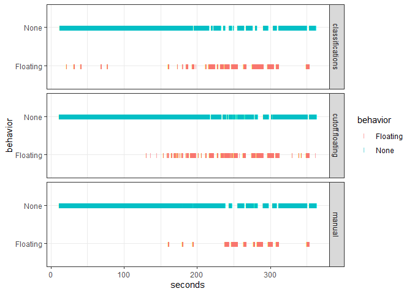<!-- -->

```r
PlotLabels(TrackingAll$FST_2.csv)
```

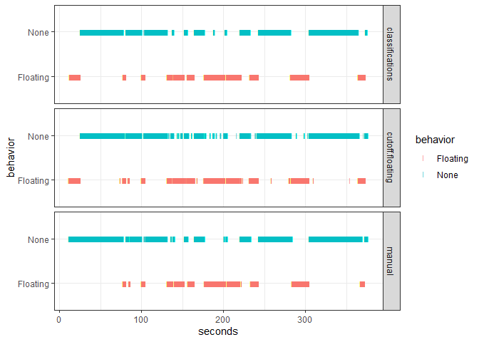<!-- -->

As we can see, on the first glance the classifications look fairly accurate. We can further compare them to each other by 
We can evaluate our results within files and for the overall experiment. The second function will create a PDF document with all LabelPlots in the working directory.


```r
EvaluateClassification(TrackingAll)
```

```
## $files
##          file    label  accuracy precision    recall correct wrong N_truth
## 1   FST_1.csv     None 0.9222352 0.9931267 0.9174550    7080   597    7717
## 2   FST_1.csv Floating 0.9537299 0.6285003 0.9537299    1010    49    1059
## 3  FST_16.csv     None 0.9514778 0.9546464 0.9484796    6020   307    6347
## 4  FST_16.csv Floating 0.8838814 0.8764090 0.8767620    2177   286    2483
## 5   FST_3.csv     None 0.9796883 0.8371989 0.9762694    5595   116    5731
## 6   FST_3.csv Floating 0.6336700 0.9419419 0.6294314    1882  1088    2990
## 7  FST_11.csv     None 0.9818325 0.8952751 0.9768941    6215   115    6362
## 8  FST_11.csv Floating 0.6994626 0.9363586 0.6971570    1692   727    2427
## 9   FST_2.csv Floating 0.9477240 0.8058663 0.9477240    2665   147    2812
## 10  FST_2.csv     None 0.8973129 0.9744659 0.8916084    5610   642    6292
##    N_compare
## 1       7129
## 2       1607
## 3       6306
## 4       2484
## 5       6683
## 6       1998
## 7       6942
## 8       1807
## 9       3307
## 10      5757
## 
## $overall
##             label  accuracy precision    recall correct wrong N_truth
## correct      None 0.9449794 0.9300058 0.9405529   30520  1777   32449
## correct1 Floating 0.8040604 0.8413818 0.8007816    9426  2297   11771
##          N_compare
## correct      32817
## correct1     11203
```

```r
PlotLabels.Multi.PDF(TrackingAll)
```

```
## NULL
```

as we can see, for floating we achieve an overall accuracy of ~80% and for None ~94%
If we want to investigate how well the classifier imitate the human experimenter across multiple files we can create a correlation plot of the final readouts. Here we are interested in the floating time for the different Labeling approaches:


```r
CorrelationPlotLabels(TrackingAll, include = c("manual.Floating.time","classifications.Floating.time","cutoff.floating.Floating.time"))
```

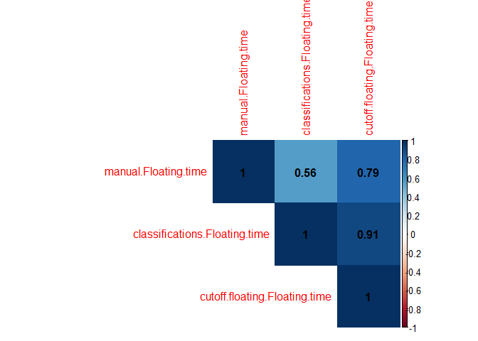<!-- -->

As we can see, training with 4 files only leads to a classifier that correlates worse to the manual scoring than the pre-set cutoff. To increase the correlation we would want to increase the size of trainings data substantially.

DLCAnalyzer can also run unsupervised clusterin methods. Here we use kmeans clustering on our machine learning data to see if this approach can resolve any behavioral syllables that are floating like.


```r
TrackingAll <- UnsupervisedClusteringKmeans(TrackingAll,N_clusters = 10,Z_score_Normalize = TRUE)
PlotLabels(TrackingAll$FST_2.csv)
```

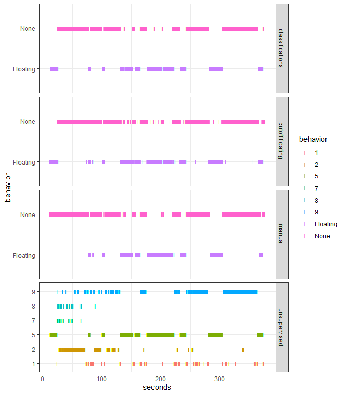<!-- -->

As you can see there is one cluster that seems to be very similar to the classifier, manual and floating cutoff. Lets plot a correlation matrix to see if this holds over all files.


```r
CorrelationPlotLabels(TrackingAll, include = c("manual.Floating.time",
                                               "classifications.Floating.time",
                                               "cutoff.floating.Floating.time",
                                               "unsupervised.1.time",
                                               "unsupervised.2.time",
                                               "unsupervised.3.time",
                                               "unsupervised.4.time",
                                               "unsupervised.5.time",
                                               "unsupervised.6.time",
                                               "unsupervised.7.time",
                                               "unsupervised.8.time",
                                               "unsupervised.9.time",
                                               "unsupervised.10.time"))
```

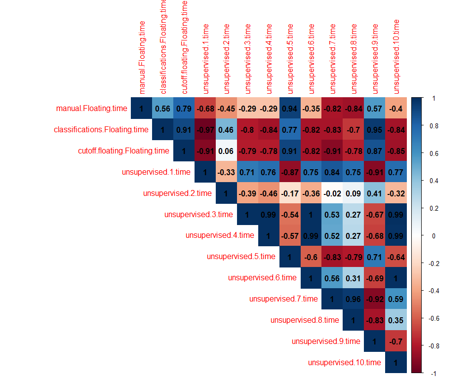<!-- -->
